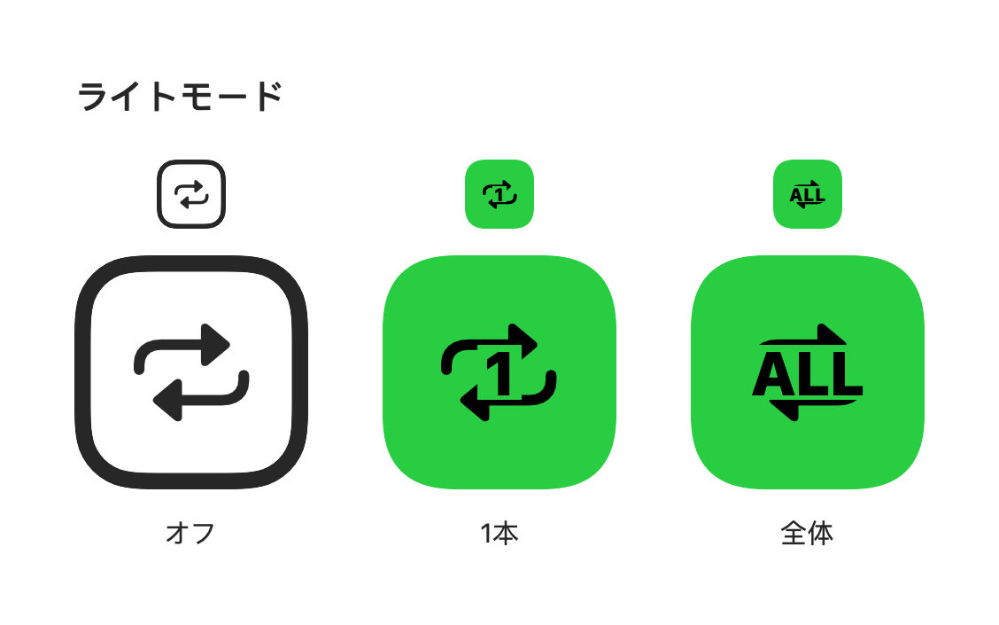
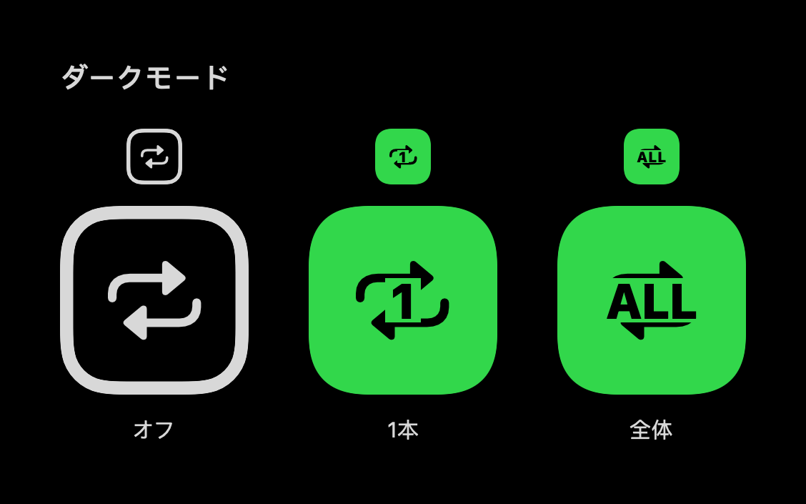

# UI プレビュー

TestFlight に入れる前に見た目を確認するためのページです。
アプリの実際のソースコードを macOS 上で描き出した画像なので、実機で出るものと同じ形になります。

> 更新のしかた: GitHub Actions の **UI Preview** ワークフローを実行 → 生成された画像を
> `docs/ui-preview/` に置いて push すると、このページに反映されます（1〜2分）。

## リピートバッジ（再生画面の右上）

上段が実寸（ツールバーでの見え方）、下段が形を確認するための拡大表示です。

### ライトモード

### ダークモード

| 状態 | 見た目 | 動作 |
| --- | --- | --- |
| オフ | 枠線だけ | 終了しても繰り返さない |
| 1本 | 緑地に「1」 | いまの動画を繰り返す（自動再生オフでも働く） |
| 全体 | 緑地に「ALL」 | 一覧の最後まで行ったら先頭に戻る（自動再生オンのとき） |
